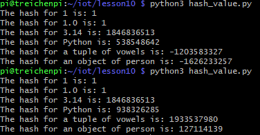
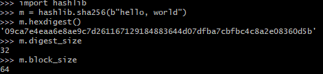
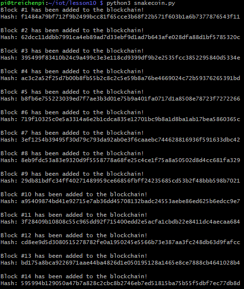
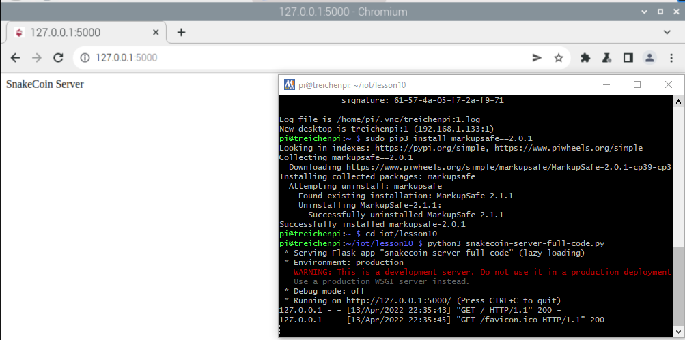
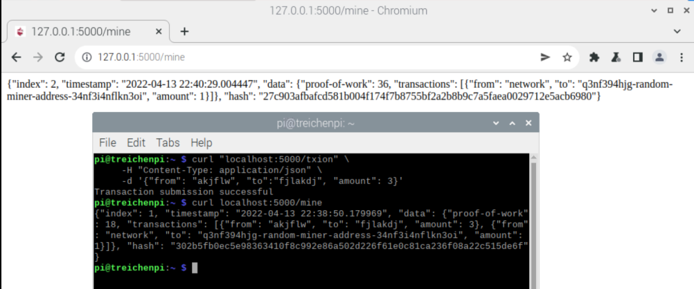
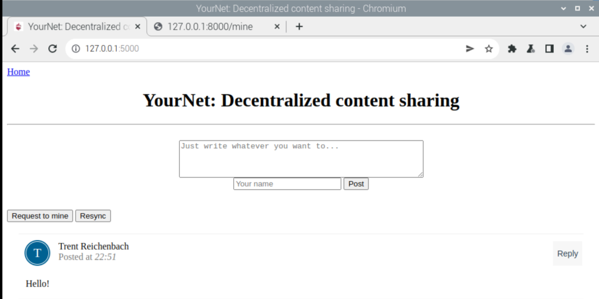
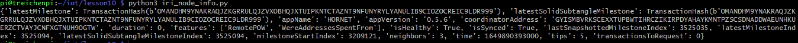

# Lab 10: Blockchain

I pledge my honor that I have abided by the Stevens Honor System.

## Running hash_value.py

## Generating SHA-256 Hash

## SnakeCoin Blockchain

## Running SnakeCoin Server

## Mining SnakeCoin Block

## Python Blockchain App

## PyOTA Node Information

