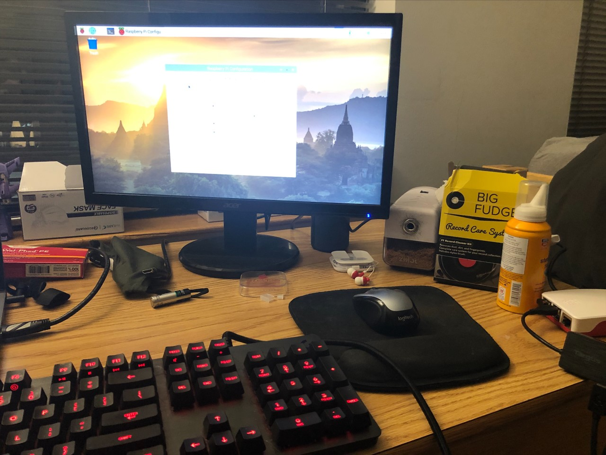
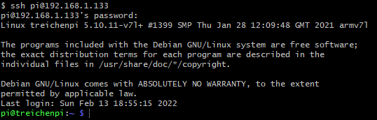
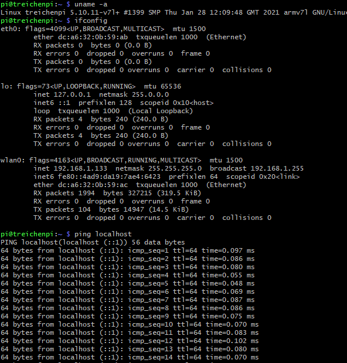
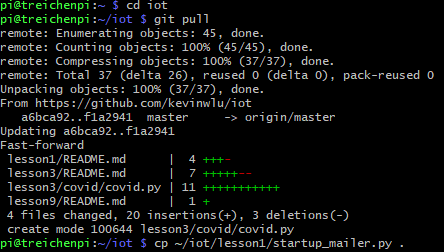
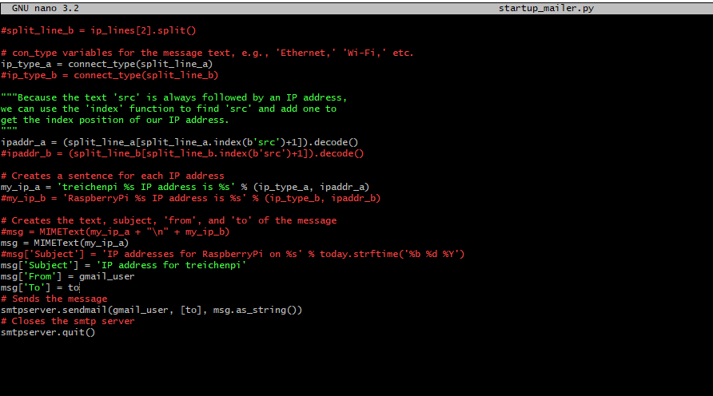
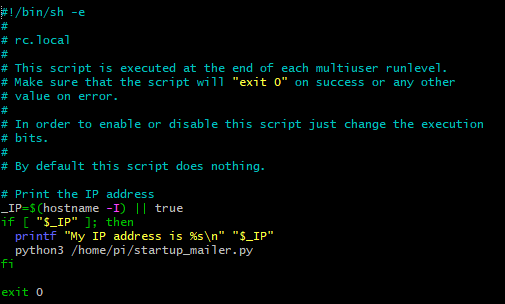
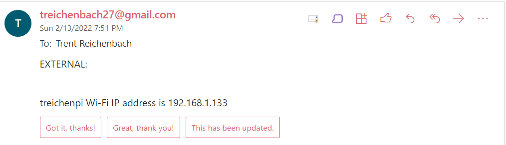
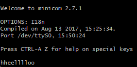
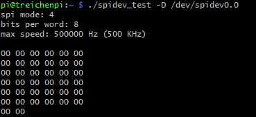

# Lab 1: Using the Raspberry Pi command line

I pledge my honor that I have abided by the Stevens Honor System.

The Raspberry Pi OS installation and SSH setup were previously done for a previous course (CPE 390).

All command line images are taken on my laptop using SSH.

## Configuring the Pi

The monitor, mouse, and keyboard are plugged into the Raspberry Pi.

## Connecting to Pi using SSH

## ping localhost

## Pulling from IOT repository

## Using GNU nano

## Editing /etc/rc.local

## Email sent by startup_mailer.py

## Using Minicom

## Running spidev-test

The SPI MOSI and MISO pins are not connected.

