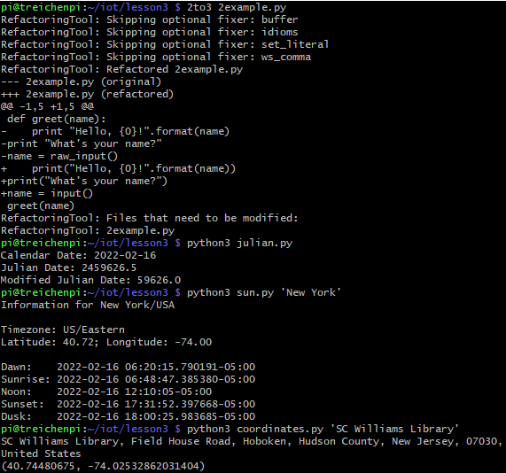
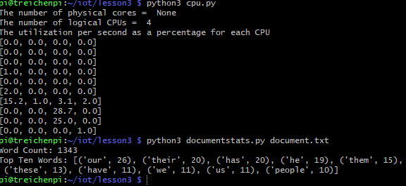
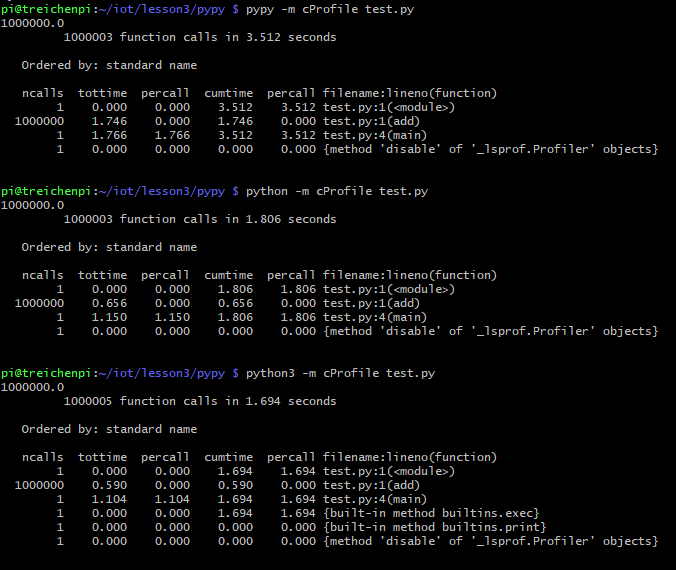
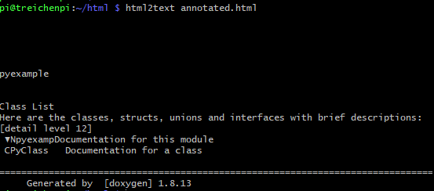
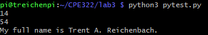

# Lab 3: Python

I pledge my honor that I have abided by the Stevens Honor System.

## Running Python Samples

These programs confirm that the necessary packages (jdcal, astral, psutil, etc.) were properly installed.

## PyPy Test

## Using Doxygen

## Running pytest.py

pytest.py is a custom Python program created to play around with using Python.
