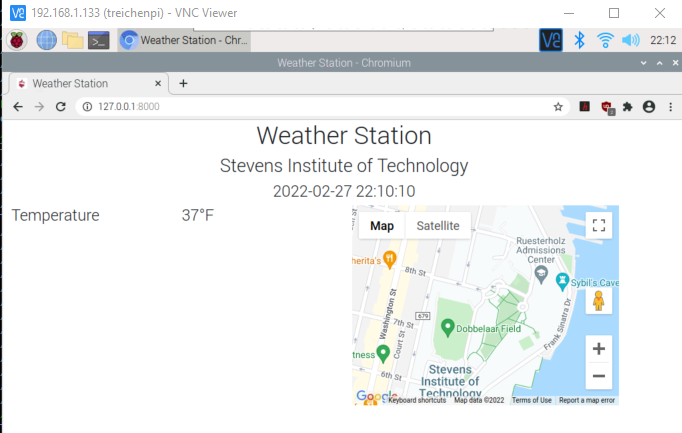
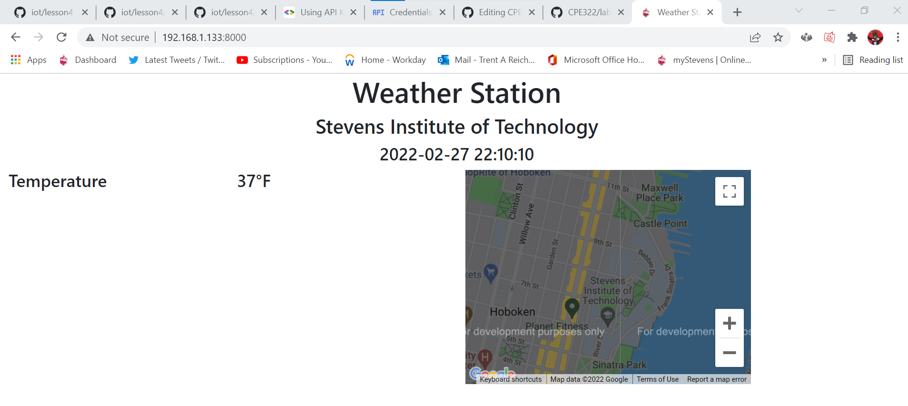
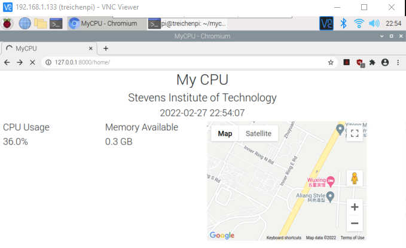
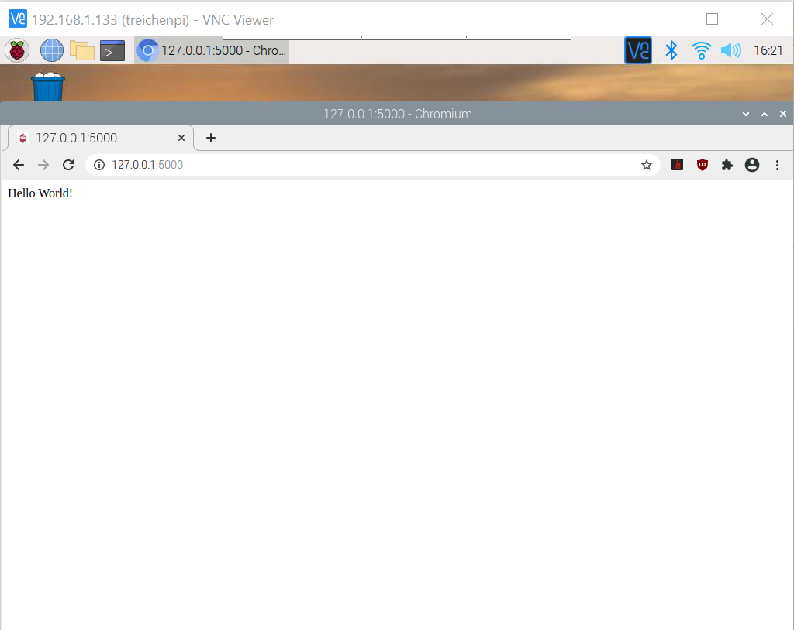
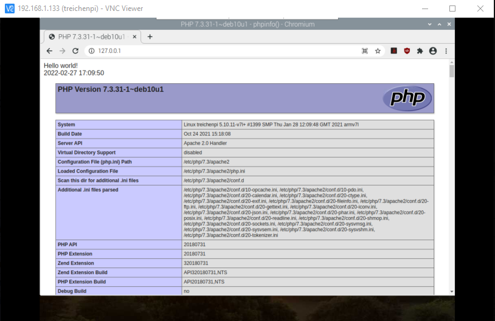
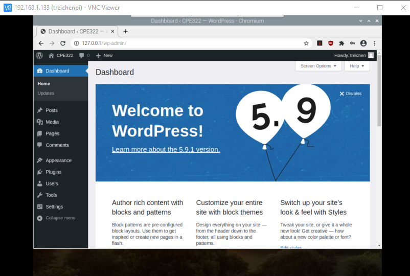

# Lab 4: Django and Flask

I pledge my honor that I have abided by the Stevens Honor System.

## Creating a Django App

## Creating a MySQL Database

## Copying Files Into App

## Weather Station App (VNC)

## Weather Station App (Laptop)

## MyCPU App

## Running a Flask App

## Apache2 Debian Default Page

## WordPress Installed on Pi

