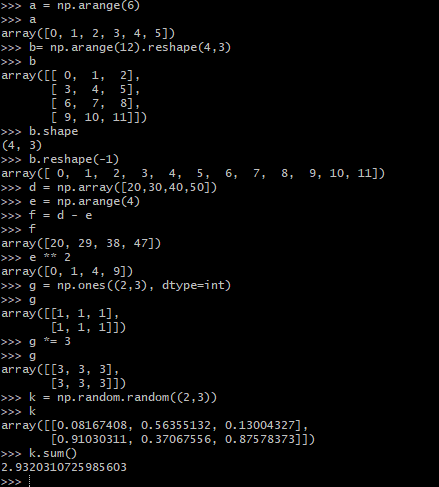
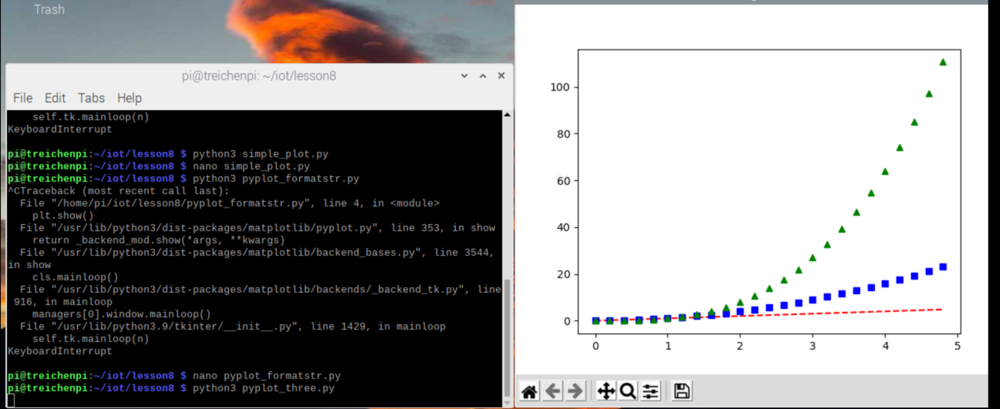
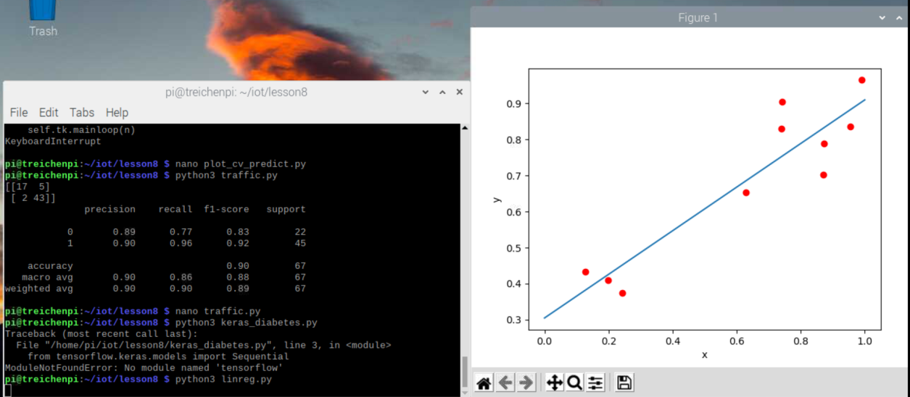
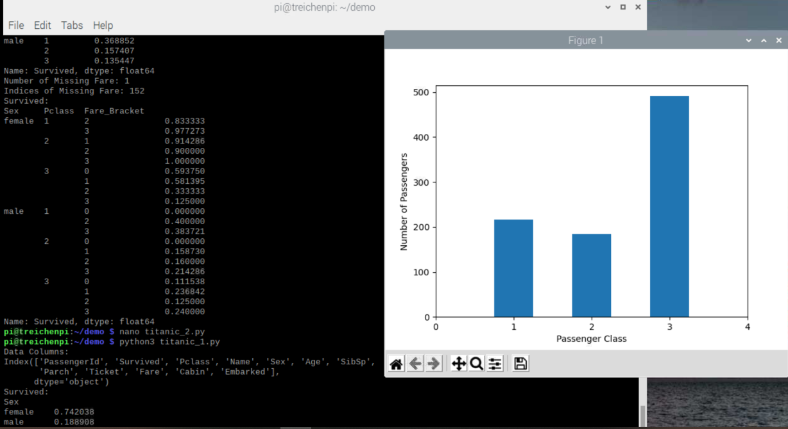
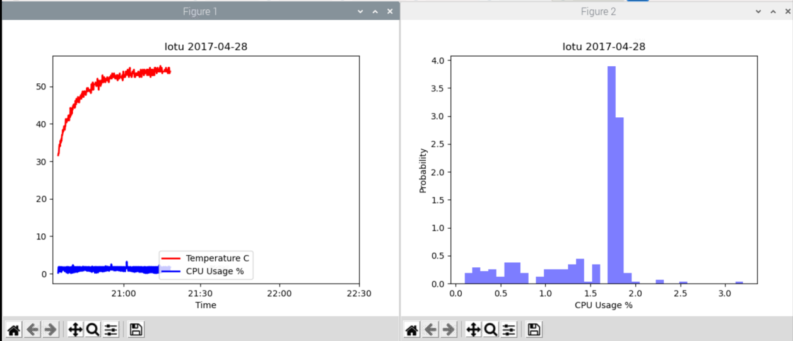
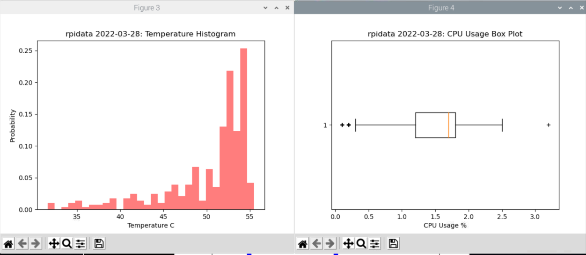
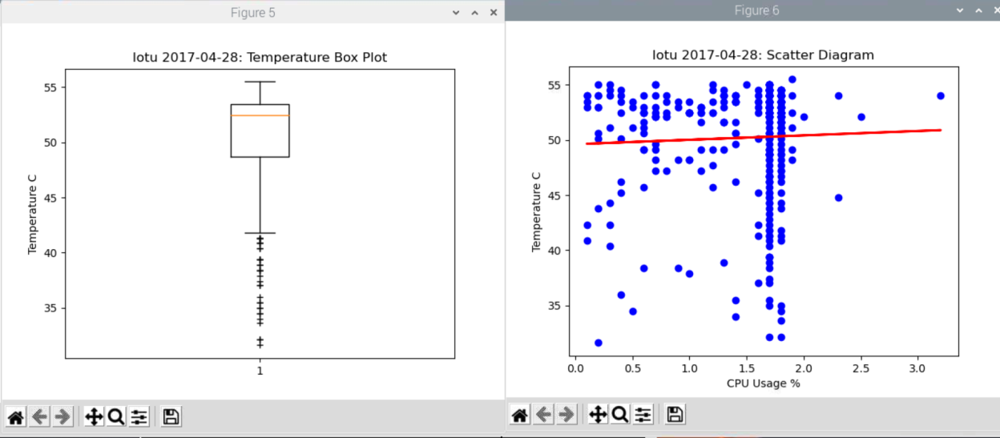
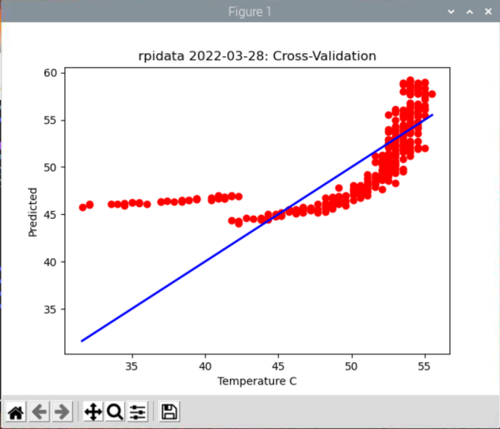

# Lab 8: Data Analysis

I pledge my honor that I have abided by the Stevens Honor System.

## Using NumPy

## Plotting with Matplotlib

## Linear Regression (SciPy)

## Titanic Example

## rpidata Plots

